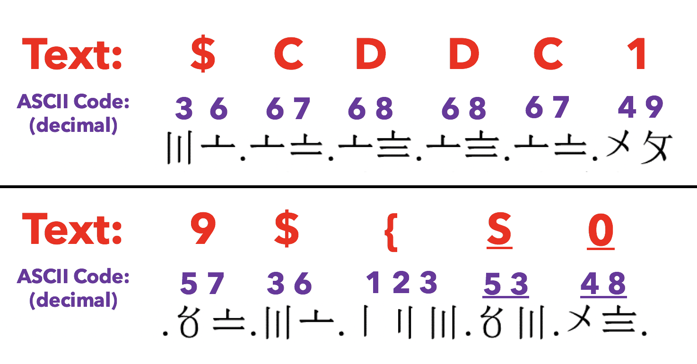

# Do You Fancy Numbers?
Misc

## Challenge 

	DESCRIPTION
	I really fancy numbers, but I have no idea what this is called!

	MD5("DoYouFancyNumbers.png"): 67F1BD93D4E3AE3DCE34F7A301026C5E

	ATTACHED FILES
	DoYouFancyNumbers.png

## Solution

*Solved by my teammate*

Explanation

- Dots are delimiters between each number
- Each symbol represents a number.
- By guessing the `$CDDC19${` flag header, we can make intelligent guess on what each symbol represents.

So after conversion from symbols to digits, we get the following

	36.67.68.68.67.49.57.36.123.53.48.95.121.48.117.95.102.52.78.99.89.95.102.108.48.87.51.114.95.78.117.77.98.51.82.53.125

Convert to ASCII

## Flag
	
	$CDDC19${50_y0u_f4NcY_fl0W3r_NuMb3R5}
