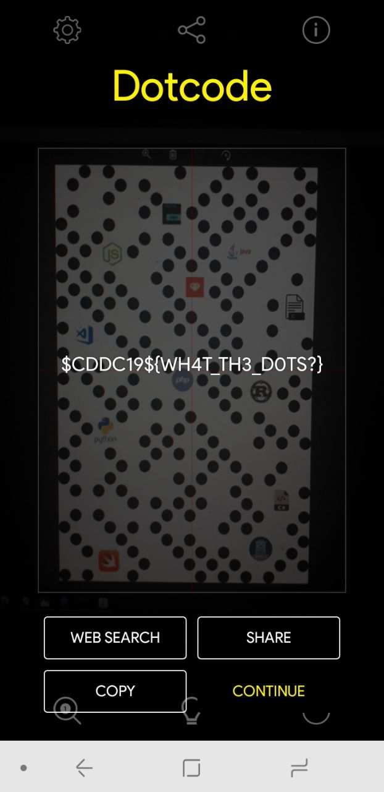

# Dot
Misc

## Challenge 

	DESCRIPTION
	.I .Love .Coding!

	MD5("1.png"): 81815ABA03F30176EC4A77D355A02396

	ATTACHED FILES
	1.png

## Solution

Dot Code

- https://cmbdn.cognex.com/dotcode

Use this app and enable DotCode in settings

- https://play.google.com/store/apps/details?id=com.manateeworks.barcodescanners&rdid=com.manateeworks.barcodescanners

## Flag

	$CDDC19${WH4T_TH3_D0TS?}
