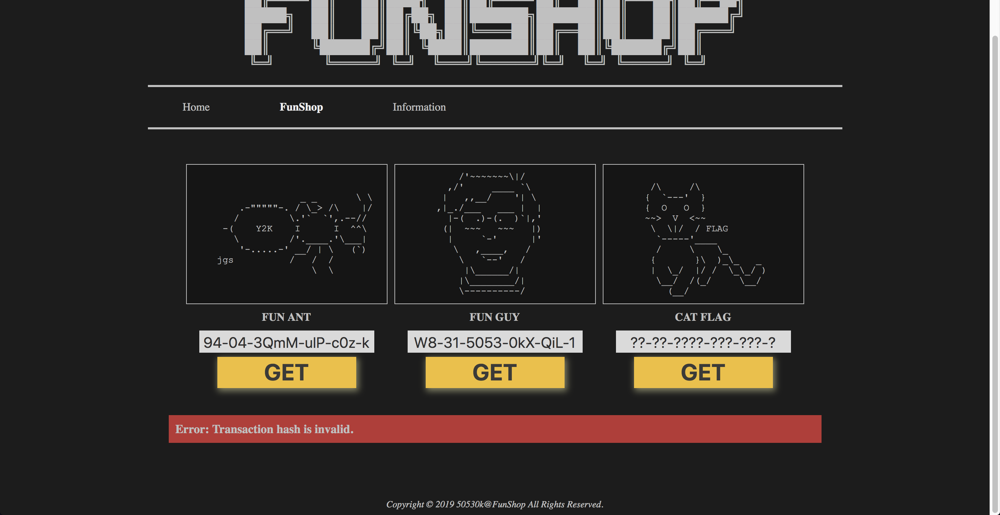

# FunShop
Crypto

## Challenge 

	DESCRIPTION
	Oops, I forgot what's the product code. Please help me to recover it!

	http://funshop.cddc19q.ctf.sg/

	ATTACHED FILES
	None

## Solution

### Understanding the challenge

We see a page with product keys for 2 items. The last one is unknown.

If we look at page source codes, we see the `transaction()` function.

http://funshop.cddc19q.ctf.sg/js/js.js

	$(document).ready(function() {
		$(".menu-select.home").trigger("click");
	});
	function menu(mid) {
		$.ajax({url: "./page/"+mid+".php", success: function(res) {
			menu_select(mid);
			$("#content-area").html(res);
		}});
	}
	function menu_select(mid) {
		var menu_list = ["home", "list", "info"];
		menu_list.forEach(function(menu_id) {
			if (mid != menu_id) {
				$("#menu-area .menu-select."+menu_id).removeClass("selected");
			} else {
				$("#menu-area .menu-select."+menu_id).addClass("selected");
			}
		});
	}
	function transaction(prod_code) {
		$.ajax({url: "./page/transaction.php?prod_code="+prod_code, success: function(res) {
			res.includes("Error")?$("#transaction_msg").addClass("err").removeClass("succ"):$("#transaction_msg").addClass("succ").removeClass("err");
			$("#transaction_msg p").html(res);
		}});
	}

	$(".menu-select.home").click(function(){menu("home");});
	$(".menu-select.list").click(function(){menu("list");});
	$(".menu-select.info").click(function(){menu("info");});

From here, we see it queries a page called `transaction.php`

- http://funshop.cddc19q.ctf.sg/page/transaction.php?prod_code=

From this, we can verify the provided transaction codes using CURL

	$ curl http://funshop.cddc19q.ctf.sg/page/transaction.php?prod_code=94-04-3QmM-ulP-c0z-k
	<!-- ?debug_mode=1 -->
	Success: Actually, I'm not an ant. "I am Groot. :P"

	$ curl http://funshop.cddc19q.ctf.sg/page/transaction.php?prod_code=W8-31-5053-0kX-QiL-1
	<!-- ?debug_mode=1 -->
	Success: ㅋㅋㅋㅋㅋㅋㅋㅋㅋㅋㅋㅋㅋㅋㅋ

Doing so via curl, we notice a strange param called `debug_mode=1` as a comment.

If we were to do a query to the page, we see the source code

- http://funshop.cddc19q.ctf.sg/page/transaction.php?debug_mode=1

[source_code.txt](source_code.txt)

---

### Analysing source code

From the source code, our parameter of `transaction.php?prod_code` is parsed and then cookies are created.

	if (isset($_GET["prod_code"])) {
	    $req_prod_code = $_GET["prod_code"];

	    foreach (array_keys($ITEMS) as $prod_code) {
	        if ($prod_code === $req_prod_code) {
	            $set_prod_code = base64_encode($req_prod_code);
	            $set_transaction_hash = $ITEMS[$req_prod_code]["hash"];
	            $set_time = time()+3600;

	            @setcookie("prod_code", $set_prod_code, $set_time, "/");
	            @setcookie("transaction_hash", $set_transaction_hash, $set_time, "/");
	            $_COOKIE["prod_code"] = $set_prod_code;
	            $_COOKIE["transaction_hash"] = $set_transaction_hash;
	            break;
	        }
	    }
	}

The cookies contain `prod_code=base64(prod_code)` and `transaction_hash=sha512(prod_code)`. 

From the source code, the cookies are then verified against each other.

	if (isset($_COOKIE["prod_code"]) && isset($_COOKIE["transaction_hash"])) {
	    $prod_code = base64_decode($_COOKIE["prod_code"]);
	    $transaction_hash = $_COOKIE["transaction_hash"];

	    if (hash("sha512",$PRIVATE_KEY.$prod_code) === $transaction_hash) {
	        $set_time = time()+3600;

	        switch ($prod_code) {
	            case("94-04-3QmM-ulP-c0z-k"):
	            case("W8-31-5053-0kX-QiL-1"):
	                echo "Success: {$ITEMS[$prod_code]["msg"]}";
	                @setcookie("prod_code", "", $set_time, "/");
	                @setcookie("transaction_hash", "", $set_time, "/");
	                break;
	            default:
	                echo "{$FLAG}";            
	        }
	    }
	} else {
	    echo "Error: Transaction hash is invalid.";
	}

In the case of the 2 provided source codes, it is hardcoded to show `Success` with no verification done.

In order to show the flag, we the following must be fulfilled:

1. prod_code must not equal to "94-04-3QmM-ulP-c0z-k" or "W8-31-5053-0kX-QiL-1"
2. transaction_hash === sha(private_key + product_key)

We can only control the product_key with no knowledge of the private_key.

### Get our known parameters first

Let's first get our known prod_code and transaction_hash.

	$ curl -v http://funshop.cddc19q.ctf.sg/page/transaction.php?prod_code=94-04-3QmM-ulP-c0z-k
	...
	> GET /page/transaction.php?prod_code=94-04-3QmM-ulP-c0z-k HTTP/1.1
	...
	< Set-Cookie: prod_code=OTQtMDQtM1FtTS11bFAtYzB6LWs%3D; expires=Fri, 31-May-2019 11:53:49 GMT; Max-Age=3600; path=/
	< Set-Cookie: transaction_hash=d23a3d6c2bd3963b969c9b2662841a8ff672cbe48e4072bf4e08301c63c3ab289030161334599e81b5d294ae0279ed38eb0a414ec79cdc0784ac493d8e08cc69; expires=Fri, 31-May-2019 11:53:49 GMT; Max-Age=3600; path=/
	...

So we know this

	Key: 94-04-3QmM-ulP-c0z-k
	Hash: d23a3d6c2bd3963b969c9b2662841a8ff672cbe48e4072bf4e08301c63c3ab289030161334599e81b5d294ae0279ed38eb0a414ec79cdc0784ac493d8e08cc69

We test that we can inject cookies using CURL

	$ curl http://funshop.cddc19q.ctf.sg/page/transaction.php
	  --cookie "prod_code=OTQtMDQtM1FtTS11bFAtYzB6LWs%3D;transaction_hash=d23a3d6c2bd3963b969c9b2662841a8ff672cbe48e4072bf4e08301c63c3ab289030161334599e81b5d294ae0279ed38eb0a414ec79cdc0784ac493d8e08cc69;"
	<!-- ?debug_mode=1 -->
	Success: Actually, I'm not an ant. "I am Groot. :P"

### hash length extension attack

Since we can only control the data appended to the fixed private_key, we identify this to be a hash length extension attack. We can use the HashPump tool to do the attack.

To execute the attack, we will append a random text to it.

	$ known_pt='94-04-3QmM-ulP-c0z-k'
	$ known_sig='d23a3d6c2bd3963b969c9b2662841a8ff672cbe48e4072bf4e08301c63c3ab289030161334599e81b5d294ae0279ed38eb0a414ec79cdc0784ac493d8e08cc69'
	$ hashpump -s $known_sig --data $known_pt -a 'HIBYE' -k 14

This provides us with the hash and the modified payload respectively.

	$ hashpump -s $known_sig --data $known_pt -a 'HIBYE' -k 14
	308f261b2064ea12a2badd037e3b96b0e19d94c8f5976b610258b2ce169734267f164de6a91abdadc77e8e31520b884d2cb84ae5eaa23408a128f75fd37bd065
	94-04-3QmM-ulP-c0z-k\x80\x00\x00\x00\x00\x00\x00\x00\x00\x00\x00\x00\x00\x00\x00\x00\x00\x00\x00\x00\x00\x00\x00\x00\x00\x00\x00\x00\x00\x00\x00\x00\x00\x00\x00\x00\x00\x00\x00\x00\x00\x00\x00\x00\x00\x00\x00\x00\x00\x00\x00\x00\x00\x00\x00\x00\x00\x00\x00\x00\x00\x00\x00\x00\x00\x00\x00\x00\x00\x00\x00\x00\x00\x00\x00\x00\x00\x00\x00\x00\x00\x00\x00\x00\x00\x00\x00\x00\x00\x00\x00\x00\x01\x10HIBYE

After which, we need to convert to base64 for the `prod_code` cookie.

	>>> base64.b64encode(b'94-04-3QmM-ulP-c0z-k\x80\x00\x00\x00\x00\x00\x00\x00\x00\x00\x00\x00\x00\x00\x00\x00\x00\x00\x00\x00\x00\x00\x00\x00\x00\x00\x00\x00\x00\x00\x00\x00\x00\x00\x00\x00\x00\x00\x00\x00\x00\x00\x00\x00\x00\x00\x00\x00\x00\x00\x00\x00\x00\x00\x00\x00\x00\x00\x00\x00\x00\x00\x00\x00\x00\x00\x00\x00\x00\x00\x00\x00\x00\x00\x00\x00\x00\x00\x00\x00\x00\x00\x00\x00\x00\x00\x00\x00\x00\x00\x00\x00\x01\x10HIBYE')

	b'OTQtMDQtM1FtTS11bFAtYzB6LWuAAAAAAAAAAAAAAAAAAAAAAAAAAAAAAAAAAAAAAAAAAAAAAAAAAAAAAAAAAAAAAAAAAAAAAAAAAAAAAAAAAAAAAAAAAAAAAAAAAAAAAAAAAAAAAAAAAAAAAAAAAAEQSElCWUU='

And then we submit the SHA512 hash and the base64 prod_code to the server

	$ curl http://funshop.cddc19q.ctf.sg/page/transaction.php --cookie "prod_code=OTQtMDQtM1FtTS11bFAtYzB6LWuAAAAAAAAAAAAAAAAAAAAAAAAAAAAAAAAAAAAAAAAAAAAAAAAAAAAAAAAAAAAAAAAAAAAAAAAAAAAAAAAAAAAAAAAAAAAAAAAAAAAAAAAAAAAAAAAAAAAAAAAAAAEQSElCWUU%3D;transaction_hash=308f261b2064ea12a2badd037e3b96b0e19d94c8f5976b610258b2ce169734267f164de6a91abdadc77e8e31520b884d2cb84ae5eaa23408a128f75fd37bd065;"
	<!-- ?debug_mode=1 -->
	$CDDC19${Me0w_m30w_@wesome!_h0w_c@n_y0u_find_me?_FUNFUN}

## Flag

	$CDDC19${Me0w_m30w_@wesome!_h0w_c@n_y0u_find_me?_FUNFUN}
