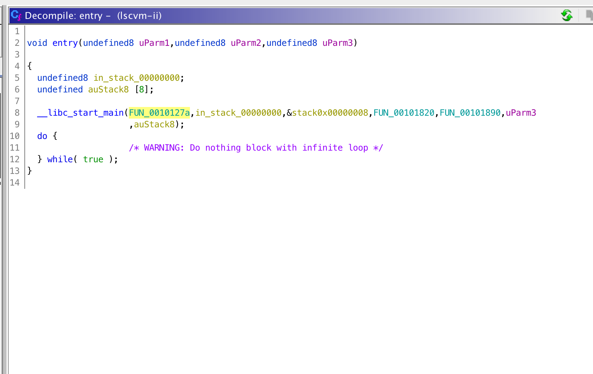
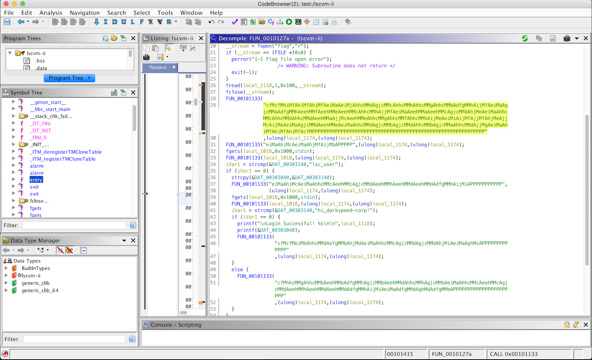
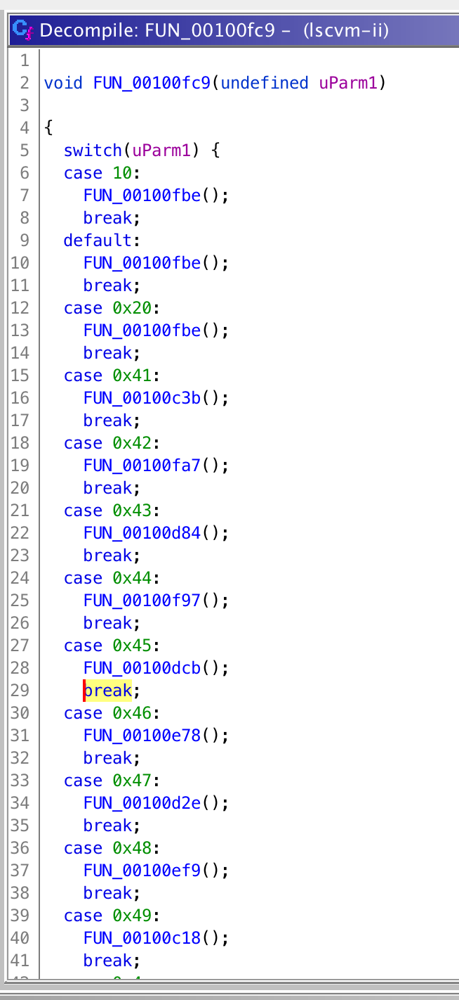
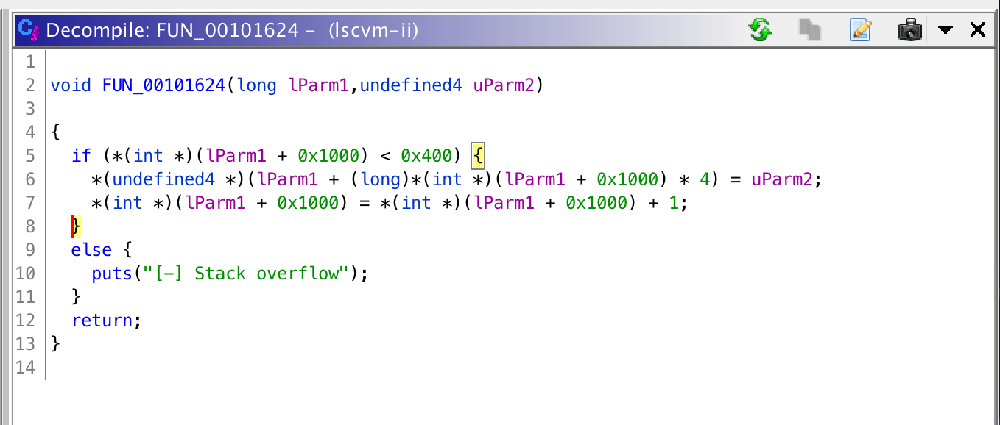
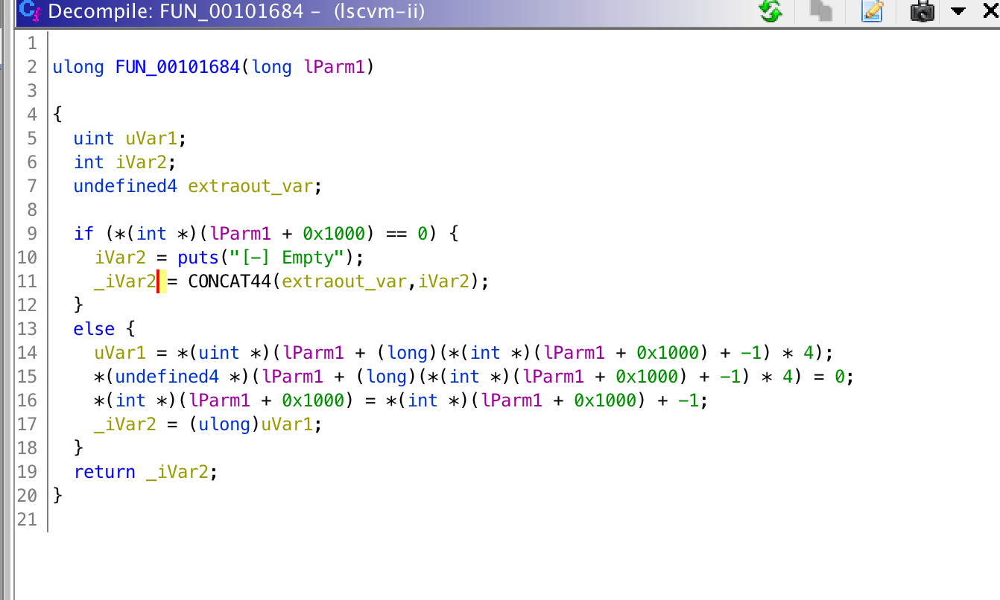
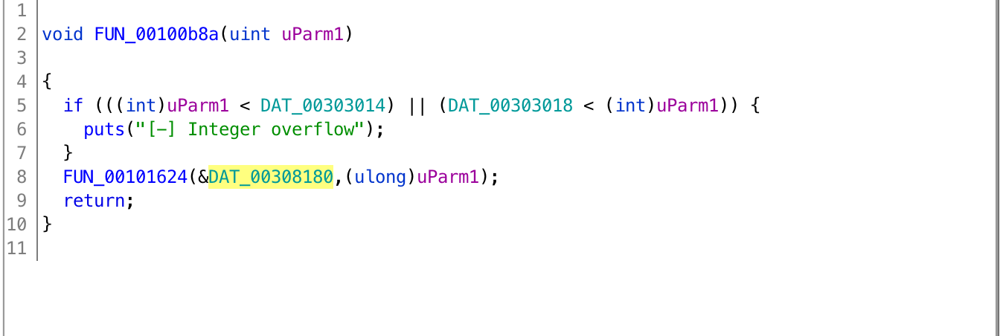
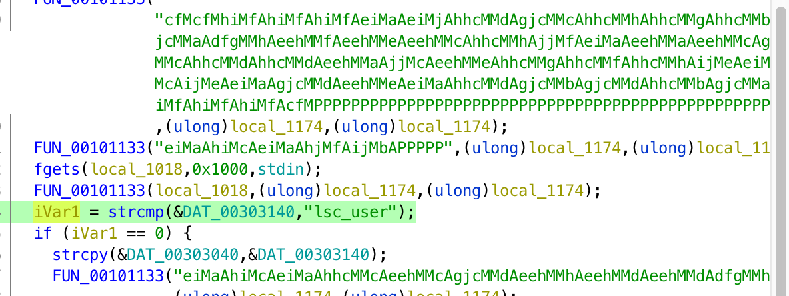
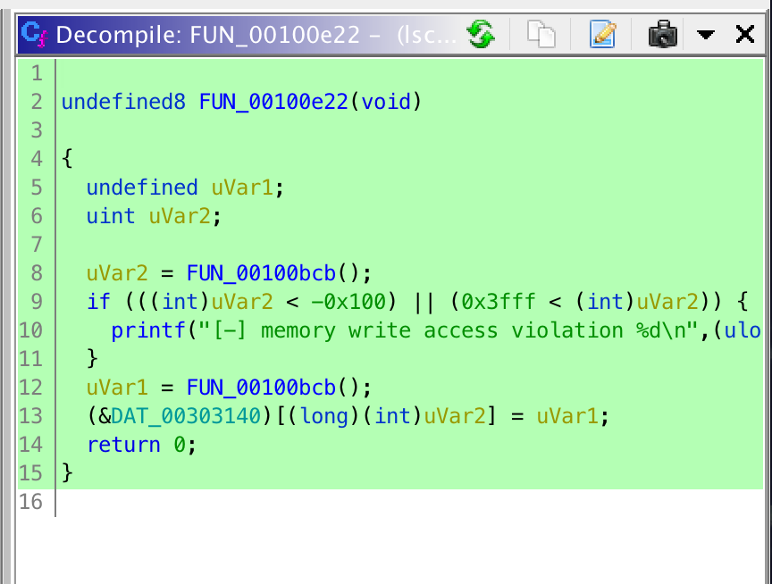
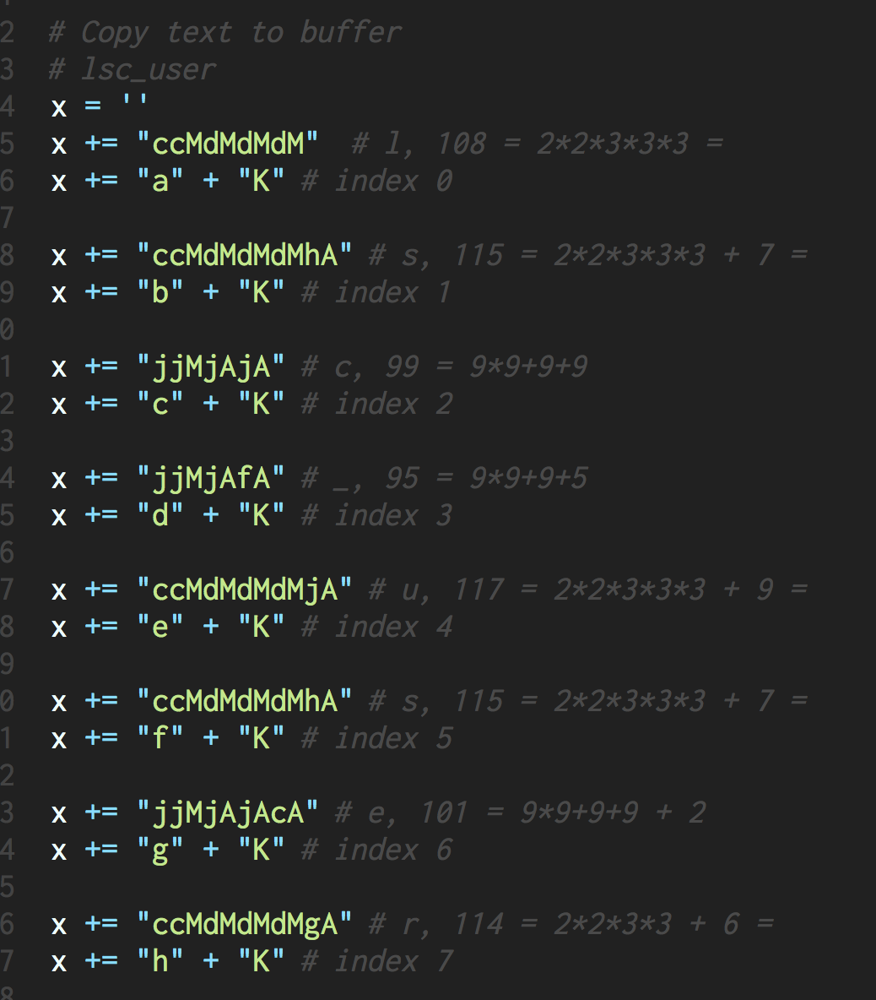

# LSCVM: Immaculate Invasion
RE

## Challenge 

	DESCRIPTION
	During our recon on the notorious fools of LightSpeedCorp, we have discovered this service which runs on a really simple, tiny, trivial, virtual machine that they have created. We are not sure of its purpose, but it certainly looks fun to play with.

	lscvm-ii.cddc19q.ctf.sg 9001

	IMPORTANT: We highly recommend you to fully understand this challenge as we will use this VM again in the Final.

	MD5("lscvm-ii"): E5172376501BA566E6DAD5A76B124C53

	ATTACHED FILES
	lscvm-ii

## Solution

### Understand the program

Using Ghidra, let's analyse the code.

This is the main function. We have a mini-VM which runs some instructions from a string.

This is the function which is a case-switch of all the instruction set.

If we look carefully, only lowercase letters `a-j` and uppercase `M, A, P` are used in the strings. We can safely ignore the others as they are unused.

- M, A, P are used which are multiply, addition and print_char respectively.

- The rest are small letters which will copy over numbers into the registers.

We see that there are 2 functions with does a push/pop of the stack respectively.

Here, my understanding is that 

- `lParam1[0x1000]` stack pointer is incremented / decremented after each instruction is called.
- `lParam1[0x1000]` keeps track of the stack pointer index.
- `lParam1` is the start of the stack.

This function checks the range of the stack before doing a push/pop. Notice the stack is at DAT_00308180.

---

### Forming the payload

Look back at main function.

We need to craft our own VM instructions to make "lsc_user"

	  FUN_00101133(local_1018,(ulong)local_1174,(ulong)local_1174);
	  iVar1 = strcmp(&DAT_00303140,"lsc_user");

Convert it into numbers

	"lsc_user"
	[108, 115, 99, 95, 117, 115, 101, 114]

For each number, convert to instruction

	l, 108 = 2*2*3*3*3 = 
	s, 115 = 2*2*3*3*3 + 7 = 
	c, 99 = 9*9+9+9
	_, 95 = 9*9+9+5
	u, 117 = 2*2*3*3*3 + 9 = 
	s, 115 = 2*2*3*3*3 + 7 = 
	e, 101 = 9*9+9+9 + 2
	r, 114 = 2*2*3*3 + 6 = 

As such, I crafted the instruction code in python

	x += "aaA" # null
	x += "ccMdMdMdMgA" # r, 114 = 2*2*3*3 + 6 = 
	x += "jjMjAjAcA" # e, 101 = 9*9+9+9 + 2
	x += "ccMdMdMdMhA" # s, 115 = 2*2*3*3*3 + 7 = 
	x += "ccMdMdMdMjA" # u, 117 = 2*2*3*3*3 + 9 = 
	x += "jjMjAfA" # _, 95 = 9*9+9+5 
	x += "jjMjAjA" # c, 99 = 9*9+9+9
	x += "ccMdMdMdMhA" # s, 115 = 2*2*3*3*3 + 7 = 
	x += "ccMdMdMdM"  # l, 108 = 2*2*3*3*3 = 
	x += 'P' * 8

With this I got the instruction set to write the chars into the buffer.

	 $ nc lscvm-ii.cddc19q.ctf.sg 9001
	=== Welcome to LSCVM(LightSpeed Corp Virtual Machine) ===
	ID : aaAccMdMdMdMgAjjMjAjAcAccMdMdMdMhAccMdMdMdMjAjjMjAfAjjMjAjAccMdMdMdMhAccMdMdMdMPPPPPPPP
	lsc_user[-] Wrong id

	# ./lscvm-ii 
	=== Welcome to LSCVM(LightSpeed Corp Virtual Machine) ===
	ID : ccMdMdMdMccMdMdMdMhAjjMjAjAjjMjAfAccMdMdMdMjAccMdMdMdMhAjjMjAjAcAccMdMdMdMgAPPPPPPPP        
	resu_csl

As my knowledge of the stack is not that good, I tried writing the string forward or backwards, but to no avail.

I needed a way to debug my values, so let's hijack the strcmp function

We can [hijack strcmp through the use of LD_PRELOAD](https://www.exploit-db.com/papers/13233).

	# gcc -fPIC -c strcmp-hijack.c -o strcmp-hijack.o
	# gcc -shared -o strcmp-hijack.so strcmp-hijack.o
	# LD_PRELOAD="./strcmp-hijack.so" ./lscvm-ii  

With this, I realised that the string is not even being compared, it is empty.

Taking a look again at the decompiled code, I realised the offset is wrong...

	iVar1 = strcmp(&DAT_00303140,"lsc_user");

***It is comparing `DAT_00303140` whereas the buffer is at `&DAT_00308180`***

Look at the instructions again...

We find one called FUN_00100e22 (instruction 0x4b)

It takes in 2 arguments, 1 for indexing and the other for the value. It will copy over the variable from stack to buffer.

We modify our code to add it in

Our code now looks like this

Try out and it is successful

	 # LD_PRELOAD="./strcmp-hijack.so" ./lscvm-ii

	=== Welcome to LSCVM(LightSpeed Corp Virtual Machine) ===

	ID : ccMdMdMdMaKccMdMdMdMhAbKjjMjAjAcKjjMjAfAdKccMdMdMdMjAeKccMdMdMdMhAfKjjMjAjAcAgKccMdMdMdMgAhK
	S1 eq lsc_user
	S2 eq lsc_user
	Password : 

Now repeat for the password

And try out locally, it works

	# LD_PRELOAD="./strcmp-hijack.so" ./lscvm-ii

	=== Welcome to LSCVM(LightSpeed Corp Virtual Machine) ===

	ID : ccMdMdMdMaKccMdMdMdMhAbKjjMjAjAcKjjMjAfAdKccMdMdMdMjAeKccMdMdMdMhAfKjjMjAjAcAgKccMdMdMdMgAhK
	S1 eq lsc_user
	S2 eq lsc_user
	Password : fcMfcMMeAaKfcMfcMMfAbKfcMjMfAcKfcMfcMMdKfcMjMhAeKfcMfcMMfAjAfKfcMfcMMhAgKfcMfcMMgAjAhKfcMfcMMdAjAiKfcMfcMMbAjKfcMfcMMbAjbAKfcMfcMMjcAKjfMjdAKfcMjMjAjeAKfcMfcMMcAjAjfAKfcMfcMMfAjAjgAKfcMfcMMdAjAjhAKfcMdMdAjiAK
	S1 eq hi_darkspeed-corp!
	S2 eq hi_darkspeed-corp!

	Login Successful! 

And go to server for flag

	$ nc lscvm-ii.cddc19q.ctf.sg 9001

	=== Welcome to LSCVM(LightSpeed Corp Virtual Machine) ===

	ID : ccMdMdMdMaKccMdMdMdMhAbKjjMjAjAcKjjMjAfAdKccMdMdMdMjAeKccMdMdMdMhAfKjjMjAjAcAgKccMdMdMdMgAhK
	Password : fcMfcMMeAaKfcMfcMMfAbKfcMjMfAcKfcMfcMMdKfcMjMhAeKfcMfcMMfAjAfKfcMfcMMhAgKfcMfcMMgAjAhKfcMfcMMdAjAiKfcMfcMMbAjKfcMfcMMbAjbAKfcMfcMMjcAKjfMjdAKfcMjMjAjeAKfcMfcMMcAjAjfAKfcMfcMMfAjAjgAKfcMfcMMdAjAjhAKfcMdMdAjiAK

	Login Successful! $CDDC19${IcY_GrE37ings_Fr0M_LigHT5pEeDC0Rp}

	lsc_user, Good Bye!

## Flag

	$CDDC19${IcY_GrE37ings_Fr0M_LigHT5pEeDC0Rp}
