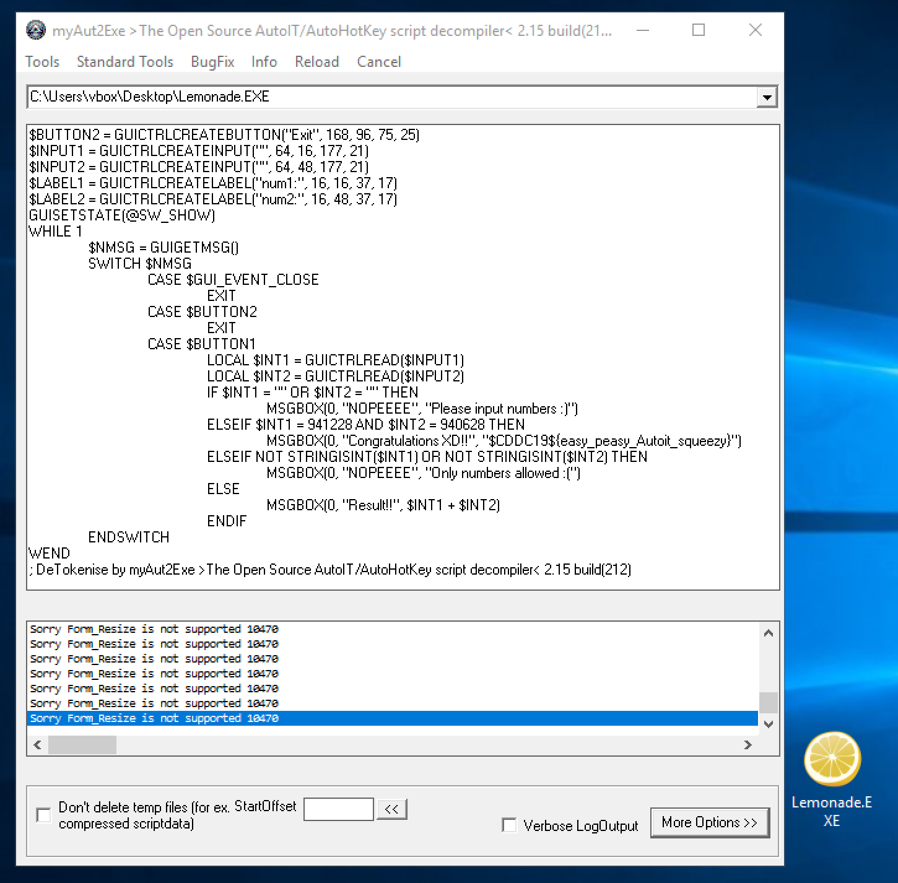

# Lemonade
RE

## Challenge 

	DESCRIPTION
	If we need lemons to make lemonade... Then what about Lemonade.EXE?

	Note: This executable is not malicious, but we strongly advise participants to run it in a VM. This should always be the case when encountering any unknown executables, and to cultivate good opsec habits. :) 

	MD5("Lemonade.exe"): B93AAC161F91891E409B6D00EDA36D4F

	ATTACHED FILES
	Lemonade.EXE

## Solution

We are given a Windows EXE file

	$ file Lemonade.EXE 
	Lemonade.EXE: PE32 executable (GUI) Intel 80386, for MS Windows

We can do some online analysis

- https://www.hybrid-analysis.com/sample/d9e0574888496e189357e79feed465de4fd1c1b056b6c7311d927178c43c07c8/5cf12a58028838b06a9dac6c

It simply does addition of 2 numbers.

---

Searching online for similar tasks, it is an AutoIt-based executable

https://www.aldeid.com/wiki/The-FLARE-On-Challenge-2015/Challenge-10

We can [decompile using Exe2Aut](http://domoticx.com/autoit3-decompiler-exe2aut/), however, the website download link was unavailable at time of writing.

Alternatively, decompile using [myAutToExe](http://files.planet-dl.org/Cw2k/MyAutToExe/myAutToExe2_15_src.7z?fbclid=IwAR1WEDSRXlLMJOfKZdwc0jO_BBjrYLIdYIztqhWPir0IKQlo5XD6UTzsmL0).

With this, we get the decompiled code

[Lemonade.au3](Lemonade.au3)

---

References:
- https://twitter.com/alex_k_polyakov/status/911655523396792320
- https://r3mrum.wordpress.com/2017/07/10/autoit-malware-from-compiled-binary-to-plain-text-script/
- https://www.autoitscript.com/autoit3/docs/intro/compiler.htm

Download Tools:
- Exe2Aut - http://domoticx.com/autoit3-decompiler-exe2aut/
- myAutToExe - http://files.planet-dl.org/Cw2k/MyAutToExe/myAutToExe2_15_src.7z?fbclid=IwAR1WEDSRXlLMJOfKZdwc0jO_BBjrYLIdYIztqhWPir0IKQlo5XD6UTzsmL0

## Flag

	$CDDC19${easy_peasy_Autoit_squeezy}
