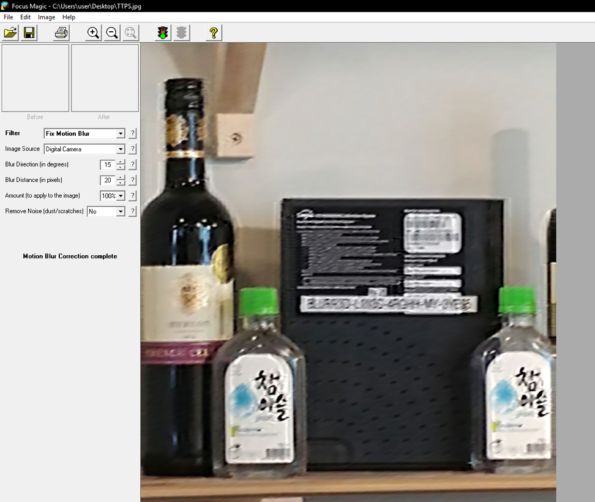
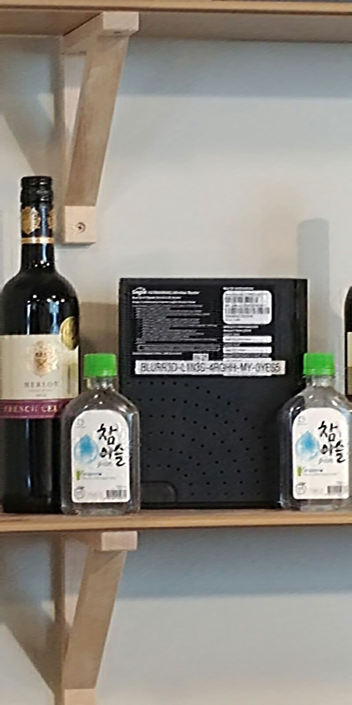

# The Terrible Photographer Strikes
Forensics

## Challenge 

	DESCRIPTION
	Bobby snuck into the LSC CEO's office and quickly snapped a picture of the CEO's personal WiFi router password. But it is so blurry that we have no means to decipher it.

	Can you help us to recover the router password?

	Note: The flag does not include the $CDDC19${....} format. Please include the format during your submission.

	MD5("TTPS.jpg"): DEDD998820BEB2262363F41633CECE9D

	ATTACHED FILES
	TTPS.jpg

## Solution

*Solved by my teammate*

	Downloaded Focus Magic
	Set the filter to FIX MOTION BLUR
	Set Blur direction to 15 degress 
	Blur width is 20px
	Apply to 100% of the image
	Do not remove noise
	Export the image

## Flag

	$CDDC19${BLURR3D-LIN3S-4RGHH-MY-3YES5}
