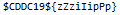

# UnZip
Forensics

## Challenge 

	DESCRIPTION
	UnZip me!

	MD5("Un.Zip"): 8C2E6C30CB4C1838768F658B9E5E9065

	ATTACHED FILES
	Un.Zip

## Solution

We have a password protected ZIP, but its file structure looks a little strange through XXD.

Looking at it, there is a ZIP file header and PNG file header.

Extract using python, split on the PNG file header.

> [extract_PNG.py](extract_PNG.py)

Alternatively, using foremost, it extracts the file out too

	 # foremost Un.Zip 
	Processing: Un.Zip
	|foundat=flag.png?PNG

## Flag

	$CDDC19${zZziIipPp}
