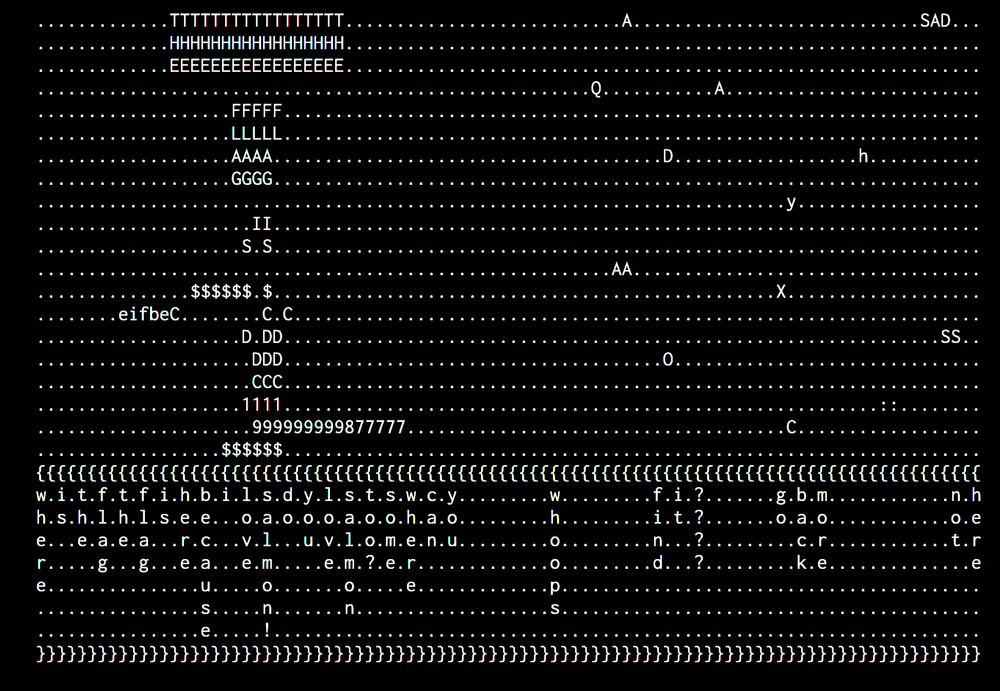
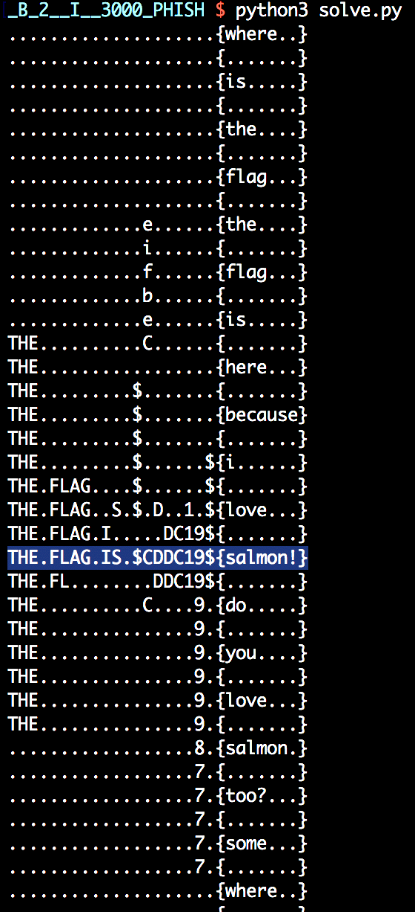

# [B-2] I <3000 PHISH
OSINT_BLUE

## Challenge 

	DESCRIPTION
	Looks like our monthly Security Awareness Training sessions were not in vain (though we all know they're just here for Domino's). Sally from Finance department alerted us on a very suspicious email with an equally suspicious document attached. Let's analyse it and see what comes up.

	MD5("job-requirements.docm"): BEE5FB1065A1E03951D5956C098565D8

	ATTACHED FILES
	job-requirements.docm

## Solution

We have a Word Document file with Macros.

We can view the macro without running it.

- Open it and click "Disable Macros" on the security prompt
- Go to the tab "View" > click on "Macros" > "View Macros"

With this, we see the code

- [macro_code.txt](./solve/macro_code.txt)

The macro simply does the following:

- Download file from https://pastebin.com/raw/J6YCXPCM
- Save file into [`C:\Users\USERNAME\AppData\Local\Temp`](http://codevba.com/office/environ.htm)`\lightspeed.txt`
- Print the downloaded file and concat some text into woohoo.txt

We get this file from pastebin

[J6YCXPCM.txt](./solve/J6YCXPCM.txt)

And then after running the macro, we get this file

[woohoo.txt](./solve/woohoo.txt)

At the bottom we see a matrix of text...

It seems to be read downwards. Let's transpose the text

## Flag

	$CDDC19${salmon!}
